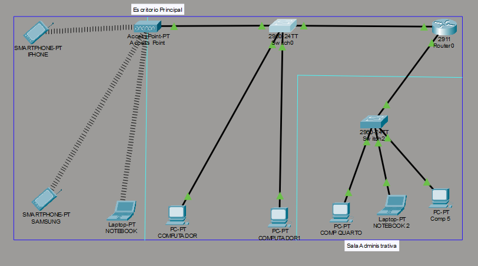
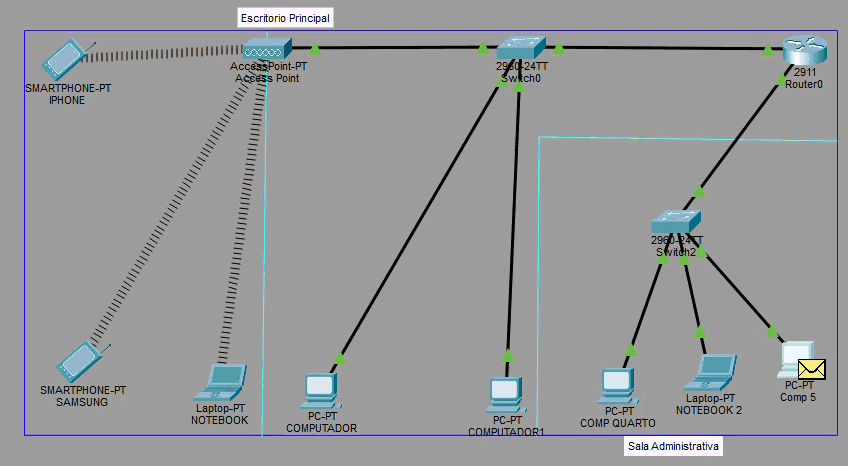
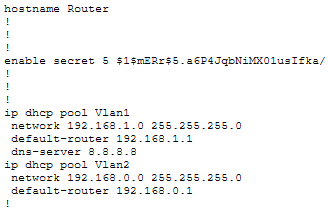
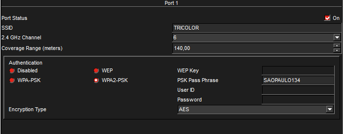

# LAN Network Simulation - Cisco Packet Tracer

Este projeto apresenta a simulação de uma rede LAN corporativa desenvolvida utilizando o Cisco Packet Tracer.

O objetivo do projeto foi aplicar conceitos fundamentais de redes de computadores como segmentação de rede com VLANs, roteamento entre redes, configuração de DHCP e acesso wireless.

---

# Topologia da Rede

A rede foi projetada utilizando topologia estrela, onde o switch atua como dispositivo central conectando todos os hosts da rede.

Dispositivos utilizados:

- Router Cisco 2911
- Switch Cisco 2960
- Access Point
- Computadores
- Notebook
- Smartphones

## Estrutura da rede

- VLAN 1 → 192.168.0.0/24
- VLAN 2 → 192.168.1.0/24

O roteador realiza o roteamento entre as VLANs utilizando Router-on-a-Stick (802.1Q).

---

# Topologia no Packet Tracer



---

# Comunicação entre dispositivos

A comunicação entre dispositivos foi validada utilizando testes de conectividade e obtenção automática de IP via DHCP.



---

# Configuração DHCP no Router

O roteador foi configurado como servidor DHCP para distribuição automática de endereços IP.

Pools DHCP configurados:

- VLAN 1 → 192.168.0.0
- VLAN 2 → 192.168.1.0


---

# Configuração do Switch

O switch foi configurado para suportar VLANs e realizar a conexão entre os dispositivos da rede.

Configurações aplicadas:

- Criação de VLANs
- Interface VLAN
- Segurança básica



---

# Configuração Wireless

A rede wireless foi configurada utilizando um Access Point com as seguintes credenciais:

SSID: **TRICOLOR**

Segurança: **WPA2-PSK**

Encryption: **AES**



---

# Principais comandos utilizados

## Configuração básica

enable
configure terminal
hostname Router1
enable secret cisco
service password-encryption

## VLANs no switch

vlan 1
name VLAN_192.168.0.0

vlan 2
name VLAN_192.168.1.0

## Router on a Stick

```bash
interface g0/0.10
encapsulation dot1Q 10
ip address 192.168.0.1 255.255.255.0

interface g0/0.20
encapsulation dot1Q 20
ip address 192.168.1.1 255.255.255.0
```
## DHCP

```bash
ip dhcp pool VLAN1
network 192.168.0.0 255.255.255.0
default-router 192.168.0.1
dns-server 8.8.8.8

ip dhcp pool VLAN2
network 192.168.1.0 255.255.255.0
default-router 192.168.1.1
dns-server 8.8.8.8
```
---

# Tecnologias utilizadas

- Cisco Packet Tracer
- VLAN
- DHCP
- Router-on-a-Stick
- Wireless Network
- IEEE 802.3 Ethernet

---

# Autor

Douglas Ferreira Cruz

Projeto desenvolvido para prática e estudo de infraestrutura de redes.
